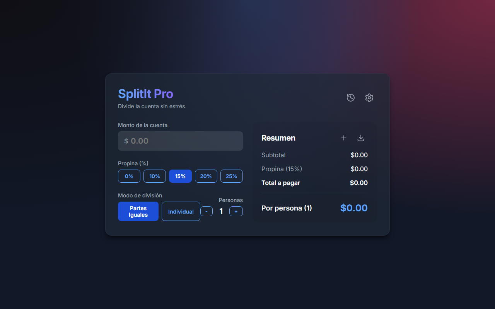
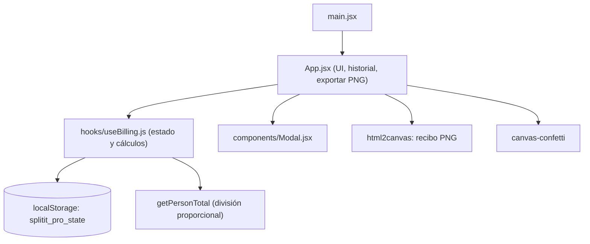

<div align="center">
  
  <h1>CuentaFacil</h1>
  <p><b>Divisor de cuentas con propina e impuestos, en partes iguales o proporcional a lo que consumió cada persona.</b></p>
  
  
  
  
  <a href="https://github.com/Luiss2080/CuentaFacil/actions/workflows/ci.yml"></a>
  <p>
    <a href="#-inicio-rápido">Inicio rápido</a> ·
    <a href="#-características">Características</a> ·
    <a href="#-arquitectura">Arquitectura</a> ·
    <a href="#-pruebas">Pruebas</a> ·
    <a href="#-lo-que-todavía-no-existe">Limitaciones</a>
  </p>
</div>

CuentaFacil es una calculadora de propinas y divisor de cuentas de una sola
pantalla (React + Vite, sin backend). Reparte el total entre N personas o
asigna a cada una lo que consumió y prorratea propina e impuesto en esa
proporción. **No** procesa pagos ni sincroniza con otras personas: todo se
calcula y se guarda en tu navegador. Dentro de la interfaz la app se muestra
con el nombre **SplitIt Pro**.

## 🎬 Vista rápida

<div align="center">
  
</div>

## ✨ Características

| Característica | Detalle |
|---|---|
| Partes iguales | Total (cuenta + propina + impuesto) dividido entre el número de personas, con botones `+`/`-`. |
| División individual | Asignas lo consumido por persona; propina e impuesto se reparten según su parte del subtotal (`getPersonTotal`). Avisa con "Falta por asignar" si la suma no cuadra. |
| Propina rápida | 0 / 10 / 15 / 20 / 25 %. |
| Moneda e impuesto | USD, EUR, BOB o MXN e impuesto local en %, desde el panel de configuración. |
| Historial | Guarda hasta 10 cuentas recientes (`MAX_HISTORY_ENTRIES`), consultables y eliminables. |
| Exportar recibo | Descarga el resumen como PNG generado en el navegador con `html2canvas`. |
| Persistencia | Estado completo en `localStorage` (clave `splitit_pro_state`). |
| Entradas saneadas | Monto, propina e impuesto rechazan NaN, infinito y negativos; las personas son siempre un entero >= 1. |
| Tema | Claro u oscuro según `prefers-color-scheme` del sistema (no hay conmutador manual). |
| Confeti | Al guardar una cuenta y al cuadrar exactamente la división individual. |

## 🏗️ Arquitectura



`useBilling` concentra el estado y las fórmulas; `App.jsx` es presentación y
acciones. Más detalle en [ARCHITECTURE.md](./ARCHITECTURE.md) (nota: ese
documento aún menciona React 18; el proyecto usa React 19) y guía de uso en
[MANUAL.md](./MANUAL.md).

## 🚀 Inicio rápido

| Requisito | Versión |
|---|---|
| Node.js | 20 o superior (el CI usa 20) |
| npm | el que incluye Node |

1. Clona e instala:
   ```bash
   git clone https://github.com/Luiss2080/CuentaFacil.git
   cd CuentaFacil
   npm ci
   ```
2. Desarrollo (http://localhost:5173):
   ```bash
   npm run dev
   ```
3. Escribe el monto, elige propina y modo de división.

Otros comandos: `npm run build`, `npm run preview`, `npm run lint`, `npm test`.

<details>
<summary>Estructura de carpetas</summary>

```text
src/
├── App.jsx            interfaz principal
├── App.test.jsx       tests de componente
├── components/        Modal.jsx
├── hooks/             useBilling.js y useBilling.test.js
├── index.css          estilos (CSS puro, glassmorphism)
├── main.jsx
└── setupTests.js
```

</details>

## 🧪 Pruebas

```bash
npm test
```

20 tests con Vitest + React Testing Library (jsdom), en 2 archivos: la lógica
de `useBilling` (propina, impuesto, división igual, saneado de entradas,
proporcional) y `App`. El CI ejecuta lint, tests y build en Node 20.

## 🔒 Seguridad

Sin backend ni datos sensibles. Lo guardado en `localStorage` se valida al
restaurarse para no propagar valores inválidos.

## 🚧 Lo que todavía no existe

- Sincronización entre dispositivos o compartir la cuenta con otras personas.
- Pagos, cobros o integración con bancos.
- Conmutador manual de tema.
- El `package.json` sigue llamándose `temp-app` y `ARCHITECTURE.md` está desactualizado (React 18).
- `npm run lint` da 1 aviso (`setState` dentro de un efecto en `useBilling.js`), sin errores.

## 📄 Licencia

MIT — ver [LICENSE](./LICENSE).

<div align="center"><sub>Hecho por Luiss2080 · React + Vite</sub></div>
